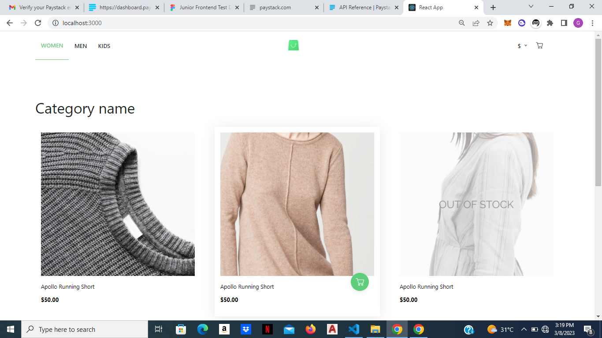
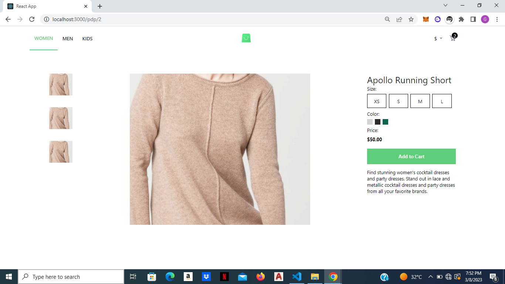
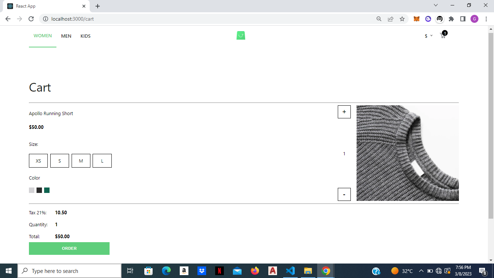

# Junior Frontend Developer Test

## 1. Brief Introduction

This test is a simple ecommerce site with a checkout button integrated with paystack. The project was built using ReactJs props, components, Router, Hooks like useState, useEffect, useRef.

## 2. Folder Structure

    -src
        -assets
            -images
        -components
        -pages
        -App.js
        -data.js
        -index.css

The images folder contains all the images used in the project. The components contains all the components used. The pages folder contains all the pages used in routing. data.js contains all the products.

## 3. Challenge

This project is my first ecommerce project so the logic was a bit confusing at first. but then i made my research and was able to tackle it properly.

## 4. Screenshots

\*picture1: Landing page with all the products.

\*picture2: A page for each product that shows its specifications.

\*picture3: The shoping cart page that shows products in the cart.

## 5. Summary

I had an amazing time building this project!!
